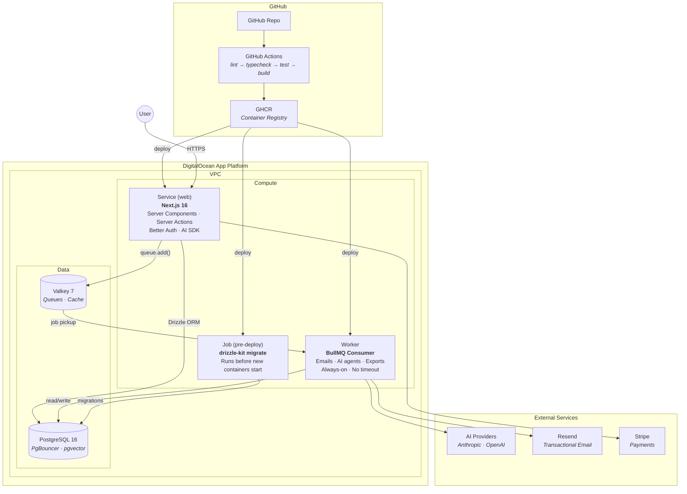
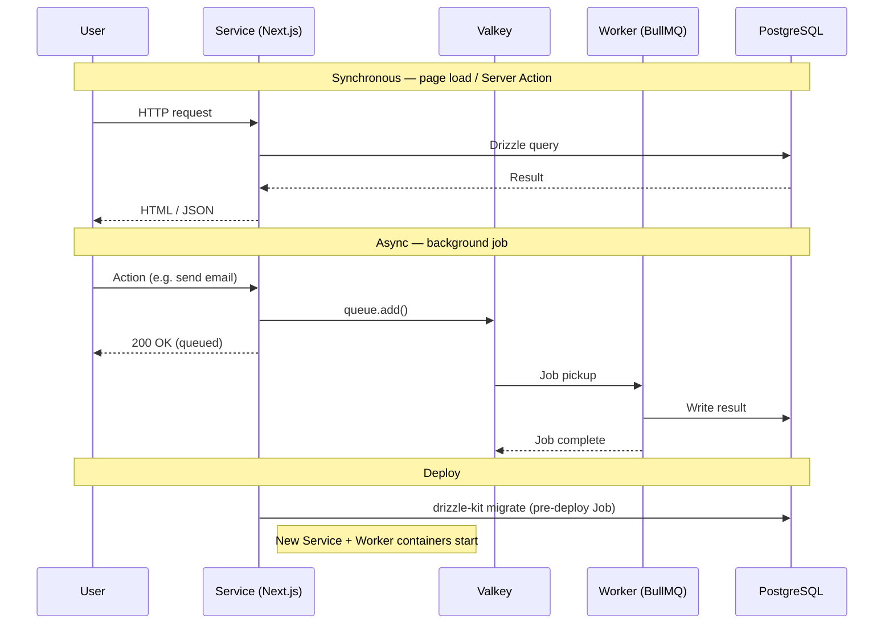

# DevHawk Seed

The DevHawk Reference Stack as a minimal, tested project scaffold. Clone it, run `/devhawk-new`, and you're ready to bootstrap a new product on Next.js 16 + Drizzle + Better Auth + BullMQ + DO App Platform.

## Quick start

```bash
# 0. Two things are needed before the install script can run:
#    a) Xcode Command Line Tools (macOS only — provides git and build tools)
xcode-select --install  # macOS only, skip on Linux/WSL2. No-ops if already installed.
#    b) GitHub CLI (the seed repo is private, so `gh` fetches the script)
brew install gh        # macOS — Linux: https://github.com/cli/cli/blob/trunk/docs/install_linux.md
gh auth login          # follow the browser flow

# 1. One-time setup on a new machine
bash <(gh api repos/fractionwork/devhawk-seed/contents/scripts/install-global-command.sh --jq '.content | @base64d')

# 2. In Claude Code, from any directory:
/devhawk-new my-project
```

The install script checks every other prerequisite, auto-installs the `/devhawk-new` slash command, installs the `frontend-design` plugin, and walks through connecting Asana or Jira Cloud via MCP. Re-run it any time to refresh the slash command or add a missing integration.

## Prerequisites

The install script above **checks all of these** and prints the exact install command for whatever is missing. Running it is faster than reading this section — treat what's below as reference.

| Tool | Purpose | Install |
|------|---------|---------|
| Node.js 22 | Runtime | `nvm install 22` (see below for nvm setup) |
| pnpm | Package manager | `corepack enable pnpm` (bundled with Node) |
| Docker | Local PG + Valkey | `brew install --cask docker` (macOS) / [docs](https://docs.docker.com/engine/install/) (Linux) |
| git | Version control | `brew install git` / `sudo apt install git` |
| jq | Used by `sync-skills.sh` to merge `.mcp.json` + `.claude/settings.json` | `brew install jq` / `sudo apt install jq` |
| `gh` | GitHub repo operations | `brew install gh` / see [cli/cli](https://github.com/cli/cli/blob/trunk/docs/install_linux.md) |
| `doctl` | DO App Platform | `brew install doctl` / `sudo snap install doctl` |
| PM2 | Dev-time process manager | `npm install -g pm2` |
| Claude Code | AI-assisted dev | `npm install -g @anthropic-ai/claude-code` |
| SSH key + registered with GitHub | git-over-SSH | `ssh-keygen -t ed25519` + `gh ssh-key add ~/.ssh/id_ed25519.pub` |

**Authenticate after installing:** `gh auth login` · `doctl auth init` (token at https://cloud.digitalocean.com/account/api/tokens). The install script checks both.

<details>
<summary><b>Detailed install commands — macOS</b></summary>

```bash
# Node.js 22 via nvm
curl -o- https://raw.githubusercontent.com/nvm-sh/nvm/v0.40.0/install.sh | bash
nvm install 22 && nvm use 22
corepack enable pnpm

# Docker Desktop
brew install --cask docker

# Everything else
brew install git jq gh doctl
npm install -g pm2 @anthropic-ai/claude-code

# SSH key (skip if ls ~/.ssh/id_ed25519.pub shows one)
ssh-keygen -t ed25519 -C "your@email.com"
eval "$(ssh-agent -s)" && ssh-add --apple-use-keychain ~/.ssh/id_ed25519

# Auth
gh auth login
gh ssh-key add ~/.ssh/id_ed25519.pub --title "$(hostname)"
doctl auth init
```
</details>

<details>
<summary><b>Detailed install commands — Linux (Ubuntu/Debian)</b></summary>

```bash
# Node.js 22 via nvm
curl -o- https://raw.githubusercontent.com/nvm-sh/nvm/v0.40.0/install.sh | bash
source ~/.bashrc
nvm install 22 && nvm use 22
corepack enable pnpm

# Docker Engine — https://docs.docker.com/engine/install/ubuntu/
sudo apt-get update && sudo apt-get install -y ca-certificates curl
sudo install -m 0755 -d /etc/apt/keyrings
sudo curl -fsSL https://download.docker.com/linux/ubuntu/gpg -o /etc/apt/keyrings/docker.asc
sudo chmod a+r /etc/apt/keyrings/docker.asc
echo "deb [arch=$(dpkg --print-architecture) signed-by=/etc/apt/keyrings/docker.asc] \
  https://download.docker.com/linux/ubuntu $(. /etc/os-release && echo "$VERSION_CODENAME") stable" | \
  sudo tee /etc/apt/sources.list.d/docker.list > /dev/null
sudo apt-get update
sudo apt-get install -y docker-ce docker-ce-cli containerd.io docker-compose-plugin
sudo usermod -aG docker $USER && newgrp docker

# git, jq, gh (via apt)
sudo apt install -y git jq
# gh: full instructions at https://github.com/cli/cli/blob/trunk/docs/install_linux.md

# doctl
sudo snap install doctl   # or download from https://github.com/digitalocean/doctl/releases

# PM2 + Claude Code
npm install -g pm2 @anthropic-ai/claude-code

# SSH + auth
ssh-keygen -t ed25519 -C "your@email.com"
eval "$(ssh-agent -s)" && ssh-add ~/.ssh/id_ed25519
gh auth login
gh ssh-key add ~/.ssh/id_ed25519.pub --title "$(hostname)"
doctl auth init
```
</details>

### Project management MCP (optional)

The `bootstrap` skill populates your project backlog in Asana, Jira, or both. The install script walks through this interactively. If you prefer manual setup:

<details>
<summary><b>Asana MCP</b></summary>

1. [https://app.asana.com/0/my-apps](https://app.asana.com/0/my-apps) → **Create new app** → name it "Claude Code MCP" → select **MCP app** → **Create app**
2. Save the **Client ID**
3. Left sidebar → **OAuth** → add redirect URL: `http://localhost:8080/callback`
4. **Manage distribution** → choose workspace(s) → **Save**

```bash
claude mcp add --transport http \
  --client-id YOUR_CLIENT_ID --client-secret --callback-port 8080 \
  asana https://mcp.asana.com/v2/mcp
```
</details>

<details>
<summary><b>Jira Cloud MCP</b></summary>

1. [https://developer.atlassian.com/console/myapps/](https://developer.atlassian.com/console/myapps/) → **Create** → **OAuth 2.0 integration** → name it "Claude Code MCP"
2. **Authorization** → **Add** next to "OAuth 2.0 (3LO)" → callback URL: `http://localhost:8080/callback`
3. **Permissions** → **Jira API** with scopes: `read:jira-work`, `write:jira-work`, `read:jira-user`
4. **Settings** → copy **Client ID**

```bash
claude mcp add --transport http \
  --client-id YOUR_CLIENT_ID --client-secret --callback-port 8080 \
  jira-cloud https://mcp.atlassian.com/v1/mcp
```
</details>

Inside Claude Code, `/mcp` lists what's connected.

### Updating existing projects

Projects bootstrapped from the seed can pull the latest seed tooling at any time:

```bash
cd my-project
bash <(gh api repos/fractionwork/devhawk-seed/contents/scripts/sync-skills.sh?ref=main --jq '.content | @base64d')
```

**Despite the filename**, this covers more than skills: it merges the seed's `.claude/skills/`, `.claude/agents/`, `.mcp.json`, and the `enabledPlugins` / `extraKnownMarketplaces` keys of `.claude/settings.json` — while preserving project-added items, your `permissions`, `hooks`, and anything else you've customized. See the skill's docs for the surgical-merge details.

For the broader update (docs, hooks, infra files), use `scripts/update-from-seed.sh` instead.

## Workflow

For every new project:

```
# In Claude Code (from any directory):
/devhawk-new my-project

# Claude clones the seed, installs deps, warms Docker images, typechecks.
# (Docker containers don't start yet — the bootstrap skill will rename
# the compose project first, to avoid collisions with other projects.)
#
# Then it immediately begins the bootstrap interview (~10 min):
#   users, data, auth, multi-tenancy, AI, integrations,
#   multi-env intent, DO Project name, aesthetic direction
#
# Then generates:
#   → Distinctive theme + styled auth pages
#   → Database schema, routes, background jobs
#   → Tests, CLAUDE.md, README
#   → app.yaml + app.staging.yaml sed-replaced with project name
#   → First real Docker start (with project-specific names/ports)
#   → Migrations applied
#   → Then offers: GitHub repo, Asana/Jira backlog, DO deploy via do-deploy skill

# Start building:
pnpm dev          # PG + Valkey + web + worker (all-in-one)

# Pick a story from Asana and tell Claude Code:
build E1-S1
```

## What's in the seed

**Infrastructure wiring (tested, rarely changes):**
- Docker multi-stage builds for Service + Worker
- DO App Platform AppSpecs: `app.yaml` (prod) + `app.staging.yaml` (staging-on-shared-clusters)
- GitHub Actions CI/CD (lint → typecheck → test → Docker build → GHCR → DO deploy), with a separate `deploy-staging` job on `develop`
- Better Auth + Drizzle adapter with organization plugin
- BullMQ queue/worker entry points with `BULLMQ_PREFIX` support for shared-cluster staging
- Sign-in + sign-up pages with shadcn/ui (restyled per project during bootstrap)
- PM2 ecosystem for single-command dev (`pnpm dev` starts everything)
- Zod env validation, TypeScript strict, ESLint + Biome

**Progressive disclosure docs** (loaded by Claude Code on demand):
- `CLAUDE.md` — root file, loaded every session (concise)
- `docs/conventions.md` — code patterns + UI design principles
- `docs/architecture.md` — stack decisions and rationale
- `docs/database-patterns.md` — Drizzle schema, queries, migrations, RLS
- `docs/auth-patterns.md` — Better Auth plugins, organizations, sessions
- `docs/background-jobs.md` — BullMQ patterns, job processing
- `docs/ai-patterns.md` — AI SDK agents, tools, streaming
- `docs/testing-patterns.md` — Vitest, Playwright, what to test
- `docs/deployment.md` — Docker, CI/CD, DO App Platform (full first-deploy recipe + 5 failure modes + staging runbook)

**Claude Code skills:**
- `bootstrap` — product discovery → distinctive design → scaffold → backlog → provision (defers DO to `do-deploy`)
- `do-deploy` — provision + deploy to DO App Platform end-to-end; discovers current state, compares to seed targets, produces a phased plan split into provisioning / code / config, executes with per-phase checkpoints. Greenfield or already-deployed
- `migrate` — analyze existing codebase → phased migration plan → backlog
- `feature-build` — implementation checklist with design-aware UI generation; ends with `/code-review`
- `cost-estimate` — fetches live DO/AWS/Vercel pricing + sizes against expected concurrency → Low/Mid/High table
- `seed-data` — generate realistic test data matching the project's schema + domain
- `playwright-cli` — drive Playwright tests and browser automation
- `update-seed-skills` — pull latest Claude tooling (skills, agents, MCP, plugins) from the seed into an existing project
- `devhawk-stack` — architectural rationale (loaded on demand for "why" questions)

**MCP servers** (auto-enabled via `.mcp.json`):
- `context7` — up-to-date library docs on demand (free tier, no auth)

**Plugins** (auto-enabled via `.claude/settings.json` `enabledPlugins`):
- `code-review@claude-plugins-official` — Anthropic's five-agent parallel review (CLAUDE.md compliance, bugs, git context, prior PR comments). Run `/code-review` after non-trivial changes
- `frontend-design` — installed by `install-global-command.sh`; prevents generic AI aesthetics

**Claude Code commands:**
- `/devhawk-new` — one-line project bootstrap (clone → install → warm Docker → typecheck → begin bootstrap)
- `/provision` — create GitHub repo + Asana/Jira backlog + defer DO to `do-deploy` (if skipped during bootstrap)

**Enforcement hooks:**
- TypeScript typecheck after every `.ts`/`.tsx` edit (PostToolUse on Write/Edit/MultiEdit)
- Auto-`db:generate` when `lib/db/schema/*` files change

**Shareable artifacts (`extras/`)**
Meant to travel outside this repo. Includes `do-deployment-brief.md` — a self-contained DO App Platform patterns brief with audit/retrofit/diagnose prompts. Paste into a non-seed project's Claude session to port the patterns over.

## Provisioning details

The bootstrap skill's Phase 4 (and `/provision`) handles each step individually:

1. **GitHub repo** — create new repo in any org (asks which), or use an existing empty repo. Pushes scaffold to main.
2. **Project backlog** — populate Asana, Jira Cloud, or both (auto-detects which MCPs are connected). Falls back to `backlog.md`.
3. **AppSpec rename** — `sed -i "s|<PROJECT_NAME>|[project-name]|g"` across `app.yaml`, `app.staging.yaml`, `.github/workflows/ci.yml`.
4. **DO deploy** — deferred to the `do-deploy` skill (runs its own discover → compare → plan → execute flow). Skipped at bootstrap time by default; invoke with "deploy to DO" when ready.

Each step is optional and degrades gracefully — if a tool isn't available, the skill writes manual-setup instructions and moves on.

## Manual setup (without the slash command)

```bash
git clone git@github.com:fractionwork/devhawk-seed.git my-project
cd my-project
rm -rf .git && git init
pnpm install
docker compose -f docker/docker-compose.dev.yml pull   # warm images; don't start yet
cp .env.example .env.local                             # then edit .env.local
# At this point, invoke the bootstrap skill in Claude Code.
# It will rename the compose project to avoid collisions, THEN start Docker, THEN migrate.
```

## Architecture



### Data flows



## Stack

| Layer | Tool | Cost (prod, single-env) |
|-------|------|------|
| Hosting | DO App Platform | — |
| &nbsp;&nbsp;Service (web) | `basic-xs` (1 vCPU / 1 GiB) | $10/mo |
| &nbsp;&nbsp;Worker (BullMQ) | `basic-xxs` (512 MiB) | $5/mo |
| &nbsp;&nbsp;Pre-deploy job | `basic-xxs` (per-run, seconds) | ~$0 |
| Framework | Next.js 16 | Free |
| ORM | Drizzle ORM | Free |
| Database | DO Managed PG 16 (`db-s-1vcpu-1gb`) | $15/mo |
| Redis/Valkey | DO Managed Valkey 7 (`db-s-1vcpu-1gb`) | $15/mo |
| Auth | Better Auth | Free |
| AI | Vercel AI SDK 6 | Free (API usage separate) |
| UI | shadcn/ui + Tailwind v4 | Free |
| CI/CD | GitHub Actions | Free (public) |
| **Prod total** | | **~$45/mo** |
| + Staging on shared clusters | +$15/mo compute, same clusters | **~$60/mo** |
| + Staging on separate clusters | +$15/mo compute, +$30/mo new clusters | **~$90/mo** |

For a full sizing model including concurrency, HA standbys, and AI API estimates, invoke the `cost-estimate` skill inside Claude Code.
